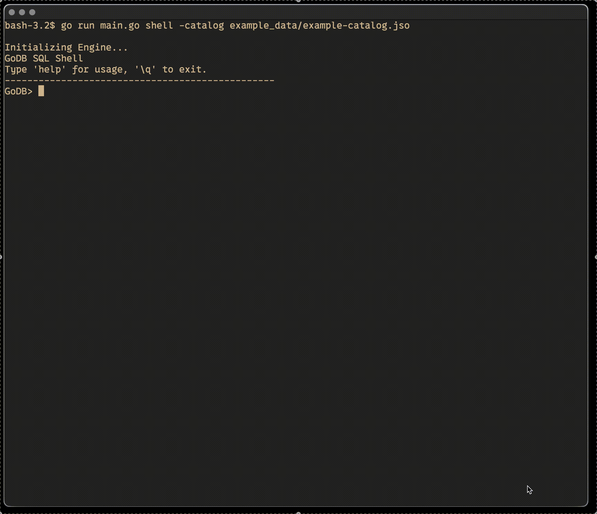
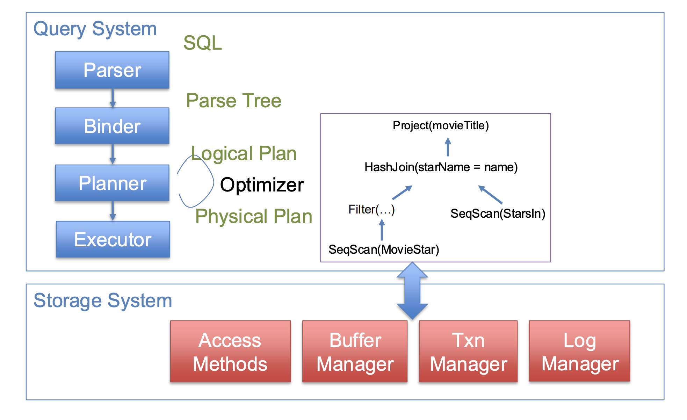

# Database Systems

A course about the foundations of database systems, focusing on basics such as the relational algebra and data model, schema normalization, query optimization, transactions, and other more advanced topics.

# Hands-On Programming Projects - GoDB

> [!IMPORTANT]
> The code here is offered as a learning aid to help you build intuition and see one possible way of solving the problem. Readers are strongly encouraged to engage actively with the material and develop their own independent implementations.

My completed projects at a glance:

| # | Title | Description | Tags |
| - | - | - | - |
| 1 | [Storage & Buffer Management](lab-writeups/lab_1.md) | The engine moves data between disk and memory, organizes that data within fixed-size pages, and provides an interface for higher-level operators to read and write tuples. | `Buffer Pool`, `Table Heap`  |
| 2 | [Query Execution](lab-writeups/lab_2.md) | Build the Execution Engine consists of the core data processing logic of a database system. | `Volcano Iterator Model`, `Indexing`, `Access Method`, `Join` |
| 3 | [Transactions & Concurrency Control](lab-writeups/lab_3.md) | Transform GoDB from a single-threaded query execution engine into a full transactional database system | `Strong Strict Two-Phase Locking`, `Locking Manager`, `Write-ahead Logging`, `Transaction Manager` |

# Readings

My paper writeups at a glance:

1. [Chapter 2. B-Tree Basics in Database Internal by Alex Petrov](readings/notes/b_tree_basic.md)
