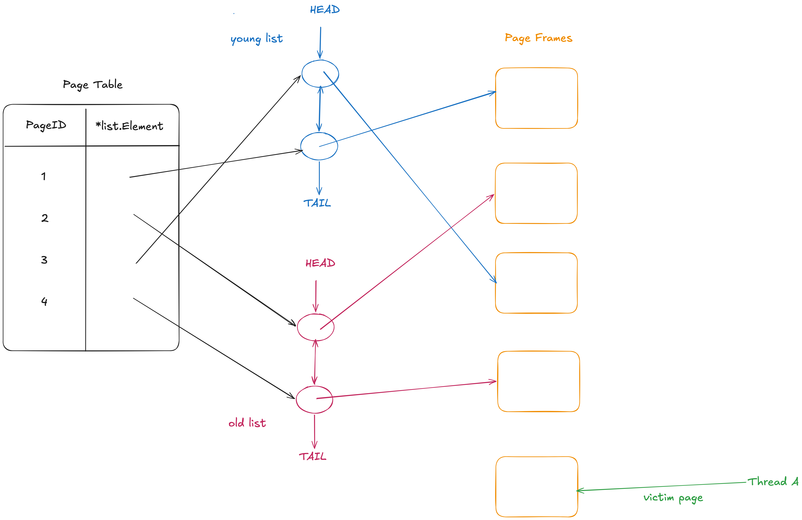

# Storage & Buffer Management

## Lab details

See [GoDB-lab-26/lab1.md](GoDB-lab-26/lab1.md)

## Test Results

* Buffer Pool: https://drive.google.com/file/d/1QXOrQVGpp2UyBpY2DJ7U9dnXr81FqLdf/view
* Table Heap: https://drive.google.com/file/d/1AU_c5HaCp4CmGXN2hRLATLpJ_RfuDKhB/view

## Related Source Code

* Buffer Pool: https://github.com/timyiu478/mit-database-systems/pull/1/changes/7287e0da801c4e8a1c5c98e29de035893cc332e5
* Table Heap: https://github.com/timyiu478/mit-database-systems/pull/1/changes/23f056f0dda6a233a642e590a8474debbcf6457e


## Design Choices

### Bitmap: optimize the scan in FindFirstZero

Our bitmap is constructed as an array of 64-bit words. To find the first zero bit, we can skip over any words that are completely filled (all bits set to 1) and locate the first word that contains at least one zero bit. Only then do we scan that specific word bit by bit, from the lowest address to the highest.

This approach is significantly faster than scanning every bit individually across all words, because the modern CPU can read 1 word in 1 cycle.

```go
for w := startWord; w < len(b.words); w++ {
    word := b.words[w]
    if word == ^uint64(0) {
        continue
}
```

A simple benchmark confirms that the word-skipping approach indeed outperforms the naive bit-by-bit scan:

```
--- PASS: TestBitmapRandomizedLarge (5.27s) // scan bit by bit
--- PASS: TestBitmapRandomizedLarge (4.72s) // word skiping
```

### Buffer Pool Management



To avoid a single global lock, the buffer pool is partitioned into shards (1 to 64 shards). Each page request is routed to a shard based on the hash of its PageID. This enables better concurrency by allowing different shards to be accessed in parallel.
However, this approach can lead to storage skew, where some shards hold significantly more pages than others.

Each shard manages its page frames using three data structures: a hash map and two linked lists.
The two linked lists implement the [2Q eviction policy (also known as Two-Queue replacement)](https://faculty.cc.gatech.edu/~jarulraj/courses/6422-O-s25/slides/08-two-q-policy.pdf), which helps resist cache pollution caused by sequential scans. The hash map serves as a page table, providing O(1) lookup of the corresponding linked list element for any given page.
All three data structures are protected by a per-shard mutex to ensure thread safety.

When a cache miss occurs and the buffer pool is full, the shard selects a victim page frame for eviction. The victim is immediately removed from both the page table (hash map) and its corresponding linked list. Only after all necessary I/O operations are completed — flushing the victim’s pending modifications to disk (if dirty) and loading the requested page’s data from disk — is the page frame added back to the page table and linked list.
This approach has two key advantages:

* It prevents the same victim page frame from being incorrectly selected for eviction multiple times.
* It ensures that no thread can ever access a partially initialized (“half-baked”) page frame.

However, performing disk I/O without holding the shard lock introduces several implementation challenges:

* Capacity Management: How to accurately track the current number of pages in the buffer pool and prevent it from exceeding its defined capacity while I/O is in progress.
* Duplicate Page Frames (Cache Miss Race): Multiple threads requesting the same page ID may simultaneously observe a cache miss (because the page table lookup happens before the new frame is inserted), resulting in multiple page frames being allocated for the same PageID.
* Duplicate Page Frames (Victim Reuse Race): A thread may request the page that is currently being used as a victim while its dirty data is still being flushed to disk, potentially leading to multiple frames representing the same page ID.

To prevent the buffer pool from exceeding its capacity during eviction, we track the number of in-flight replacements using an integer numBaking.
A new page frame is created only if the current number of pages in the linked lists plus numBaking is strictly less than the shard’s capacity.

To prevent cache-miss races and victim-reuse races, we introduce a per-page lock.
In GetPage(), the first step is to acquire the page lock for the requested PageID. This lock is held throughout the entire function and released only at the end (on both hit and miss paths).
When selecting a victim for eviction, we not only choose a frame with refCount == 0, but also attempt to acquire its lock. The victim’s latch is released only after its dirty data has been successfully flushed to disk (if it was dirty).
As a result, if another thread requests a page that is currently being used as a victim (while its dirty data is still being written to disk), that thread will block on the page lock until the flush completes.

### Table Heap

The InsertTuple function is the only code path that allocates and initializes new physical pages. Page-allocation and the decision logic for how many pages to create are protected by a dedicated mutex, preventing over-allocation.

Initialized pages contain a magic value at a fixed header offset; checking that offset tells us whether a page frame is initialized. The table-heap iterator relies on this to wait for a newly allocated page to be initialized, assuming the allocator will initialize it quickly:

The iterator takes a read latch on a page frame immediately after acquiring it and holds that latch until Next() advances to the following page. This design assumes the iterator caller will scan rows quickly.

## Implementation Challenges

### Heap Page

To initialize a heap page, we must calculate the maximum number of rows (slots) it can hold. This creates a circular dependency because:

* The number of slots affects the required bitmap size, and
* The bitmap size affects how many slots can actually fit in the page.

### Buffer Pool

Many requirements have to fulfil:

* Thread-safe
* IO concurrency
* Resistant to cache pollution from sequential scans
* Fixed pool size
* Ensure the invariant that there is a strict 1-to-1 relationship between a page ID and its corresponding page frame in the buffer pool

### Table Heap

Thread-safe heap page initialization, page allocation, and tuple access.

## Mistakes I made

### Heap page

The heap page header contains two bitmaps: an allocated bitmap and a deleted bitmap.

When MarkAllocated() clears the allocated bit of an object, the corresponding bit in the deleted bitmap must also be cleared.

### Buffer Pool

The UnpinPage() function decrements the reference count of a PageFrame, allowing it to become eligible for eviction once no threads are actively using it. The setDirty flag indicates whether the page was modified and should be written back to disk before eviction.

If UnpinPage() decrements the reference count before setting the dirty flag, a subtle race condition can occur. After the reference count reaches zero but before the dirty flag is set, another thread may select this frame as a victim for eviction. In that case, the evicting thread sees isDirty == false and directly overwrites the frame’s bytes with new data from disk — without flushing the pending modification to disk. This results in a lost update and breaks invariants.

```go
func (bp *BufferPool) UnpinPage(frame *PageFrame, setDirty bool) {
    if frame.refCount.Load() <= 0 {
        panic("Unpinning a page with refCount <= 0")
    }
    frame.refCount.Add(-1)        // A context switch here can allow eviction
    if setDirty {
        frame.isDirty.Store(true) // Too late — dirty flag may not be visible to evictor
    }
}
```

Correct order: Always set the dirty flag before decrementing the reference count.

```go
func (bp *BufferPool) UnpinPage(frame *PageFrame, setDirty bool) {
	if frame.refCount.Load() <= 0 {
		panic("Unpinning a page with refCount <= 0")
	}
	if setDirty {
		frame.isDirty.Store(true)
	}
	frame.refCount.Add(-1)
}
```

### Table Heap

In DeleteTuple and UpdateTuple I return in the ErrTupleDeleted branch without unpinning the page.

How I found the bug:

1. Discovered the actors in TestTableHeap_ConcurrentMixedWorkload were stuck because the buffer pool was full and could not find a page frame to evict.
1. Identified that no page frame had a zero pin count, which prevented eviction.
1. Observed that the pin counts of the page frames kept growing.

## Key Takeaways

* High-performance scans by checking 64 bits at a time using standard CPU word operations
* The Buffer Pool eviction policy (2Q) that is resistant to cache pollution from sequential scans
