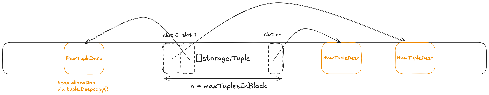

# Query Execution

## Lab details

See [../GoDB-lab-s26/lab2.md](../GoDB-lab-s26/lab2.md)

## Test Results

* Sequential Scan, Filter, Projection, and Limit Executors: https://drive.google.com/file/d/1izQUZsfCWIFb8RbpNjElpGywfW5wBSrJ/view?usp=drive_link
* Index and Index Scan Executors: https://drive.google.com/file/d/149IyE786tChJREHFUJhjixOapA_rj0DF/view?usp=drive_link
* Insert, Delete, and Update Executors: https://drive.google.com/file/d/1HSA5VosKSPbXOvooXG-GHO7SMUe95lzq/view?usp=drive_link
* Block Nested Loop Join Executor: https://drive.google.com/file/d/1o88dswzepsdjJA-O7stxoRwJTrvOHXln/view?usp=drive_link
* Sort Executor: https://drive.google.com/file/d/1XA56S5x44cRsFn6PYxciizQ5Or_FguRF/view?usp=drive_link
* Aggregate Executor: https://drive.google.com/file/d/1EmbwN7UChtIVYVWnK0Jdl47kVLRtXZER/view?usp=drive_link
* Hash Executor: https://drive.google.com/file/d/1eke0IKjkpe1c0WuFmuZZ26hSsCNEkVv6/view?usp=sharing
* TopN Optimization Executor: https://drive.google.com/file/d/1KYs2uAH9pAWtnf6KwjosnYIC2TYcq_sD/view?usp=sharing

## Related Source Code

https://github.com/timyiu478/mit-database-systems/pull/2/changes

## Design Choices

### Block Nested Loop Join Executor



The join buffer is implemented as a slice of [storage.Tuple](https://github.com/MIT-DB-Class/GoDB-lab-s26/blob/main/storage/tuple.go#L97-L111), with its capacity constrained by maxTuplesInBlock. Each storage.Tuple acts as a container that holds a pointer to its **materialized** raw tuple data, which conforms to a specific RawTupleDesc.

The maximum number of tuples the buffer can hold is calculated during the **initialization** of the join executor. Since the RawTupleDesc determines a fixed byte size for every tuple in the relation (by summing fixed-size integers and fixed-length strings), we can determine the overhead per entry precisely:

$$N_{max} = \left\lfloor \frac{\text{Block Size}}{\text{sizeof}(\text{storage.Tuple}) + \text{sizeof}(\text{storage.RawTupleDesc})} \right\rfloor$$

Key Design Advantages:

* Fixed-Size Predictability: By using RawTupleDesc to enforce [8-byte alignment and fixed-length fields](https://github.com/MIT-DB-Class/GoDB-lab-s26/blob/main/storage/tuple.go#L60-L80) (e.g., `common.StringLength`), the executor can allocate a join buffer that maximizes memory utilization without the risk of an OutOfMemory error during the join process.
* Implementation Simplicity: Using `tuple.DeepCopy()` allows the join buffer to take ownership of the data. This prevents issues where the buffer might otherwise point to a page in the buffer pool that could be evicted or modified.
* Initialization: Calculating capacity at the start of the operator's execution avoids the computational overhead of checking remaining memory for every individual insertion.


## Mistakes I made

### Insert Executor

The insert executor should insert all tuples at one `Next` function call.
The `Current` function should return the total number of tuples inserted instead of the last inserted tuple.

### Delete Executor

The following code attempts to delete tuples while the child executor is still actively "pointing" at them.

```go
func (e *DeleteExecutor) Next() bool {
	if e.deleteDone {
		return false
	}
	for {
		ret := e.child.Next()
		if !ret {
			e.deleteDone = true
			break
		}
		err := e.tableHeap.DeleteTuple(e.ctx.txn, tuple.RID())
        // ...
	}
}
```

This code causes deadlock becase there is a circular dependency between the parent and child executors involving the buffer pool's concurrency control.

The `DeleteExecutor.Next()` first calls `e.child.Next()` and then calls `tableHeap.DeleteTuple` is the root cause of the deadlock problem.

1. Child Latch Acquisition: When `e.child.Next()` is called (e.g., a SeqScanExecutor), it fetches a page from the buffer pool, pins it, and [holds a Read Latch](https://github.com/timyiu478/mit-database-systems/blob/main/GoDB-lab-s26/execution/table_heap.go#L329-L334). This ensures the tuple data doesn't change while the executor is using it.
2. Parent Latch Request: the DeleteExecutor receives the tuple and immediately calls `tableHeap.DeleteTuple`. To perform the deletion, the TableHeap must [acquire a write latch](https://github.com/timyiu478/mit-database-systems/blob/main/GoDB-lab-s26/execution/table_heap.go#L142) on that exact same page.
3. The Deadlock (Circular Wait): The Write Latch can not be acquired while a Read Latch is already held. The DeleteExecutor sits waiting for the Write Latch. However, the ScanExecutor will only release its Read Latch when it moves to the next page or is closed—actions that are blocked because the DeleteExecutor is stuck.


```console
-----------------------
|  Delete Executor    | # (2) e.tableHeap.DeleteTuple(...) -> tries to acquire write latch on the same page
-----------------------
        ^
        |
-----------------------
|  Scan   Executor    | # (1) e.child.Next() -> hold a read latch on the page
-----------------------
```

To fix this, we break the pipeline. We "materialize" the targets first so that the child can finish its work and release its latches before the parent begins the modification work.

### Update Executor

Performing an in-place update requires careful sequencing to prevent index corruption. If the table heap is modified before the index is updated, the original attribute values are overwritten, effectively destroying the information needed to calculate the 'old' index keys. To maintain consistency, the executor can first delete the existing index entries using the current tuple data, then perform the in-place update on the heap, and finally insert the newly generated keys into the indexes.

### Index Executor

In cases where an index key is associated with multiple RecordIDs, the IndexScanExecutor must buffer the resulting RID list and yield the corresponding tuples one by one across successive Next() calls.

### Sort Executor

In SQL, sorting is usually **lexicographical**: we sort by the first column, and only if there is a tie do we look at the second column.

```go
sortFunc := func(a, b TupleWithOrdKey) int { 
    for i := 0; i < len(e.plan.OrderBy); i++ {
        ret := a.keys[i].Compare(b.keys[i]) 
        if ret != 0 {
            if e.plan.OrderBy[i].Direction == planner.SortOrderDescending {
                return -1 * ret
            }
            return ret
        }
    }
    return 0
}
slices.SortFunc(e.tuples, sortFunc)
```

### Top-N Optimization

To keep the "Best" values in a **Max**-Heap, Less(i, j) should return true if i is greater than j.

## Implementation Challenges

### Block Nested Loop Join

* How to implement the BNLJ algorithm in iterator model
* Edge Cases: Left/Right table is empty

## Implementation Tips

### Aggregation Executor

Based on test cases, the Aggregate Executor should return a tuple where the schema is:

[Group By Key 1, Group By Key 2, ..., Aggregation 1, Aggregation 2, ...]

If there are no group-by keys (a global aggregate), the tuple contains only the aggregation results.

The "Ignore" Rule:

* Standard aggregate functions—like SUM(), AVG(), MIN(), MAX(), and COUNT(column)—simply skip over NULL entries as if they don't exist. They do not treat them as zero; they treat them as "missing."
* The Exception: COUNT(*) is the only aggregate that does not ignore NULLs. It counts the total number of rows, regardless of what is inside them.
* When an aggregate function processes a set of rows where the target column is NULL in every row, the result should be NULL.

## Key Takeaways

* Plan node vs executor vs child
