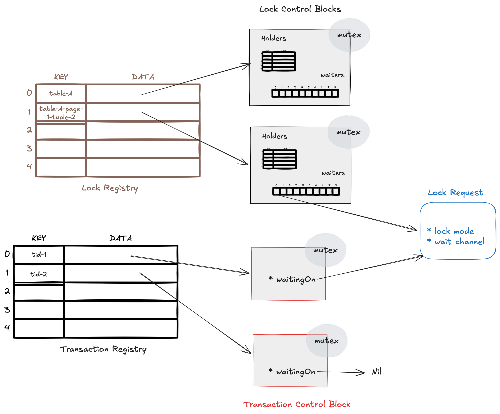
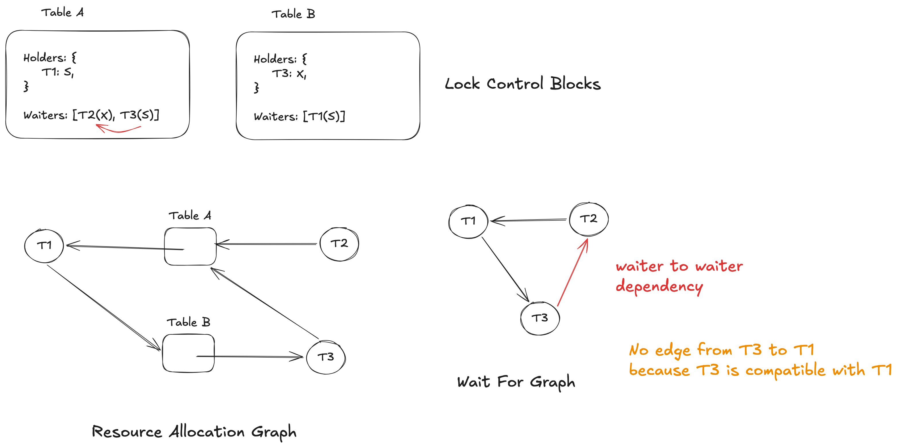
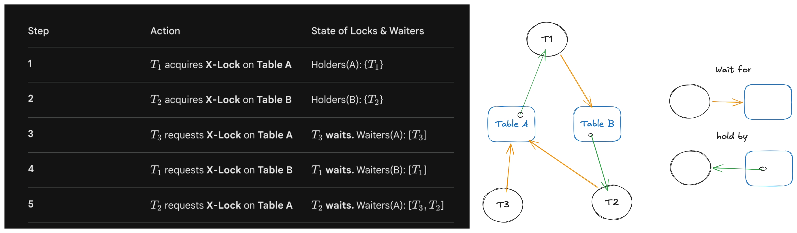
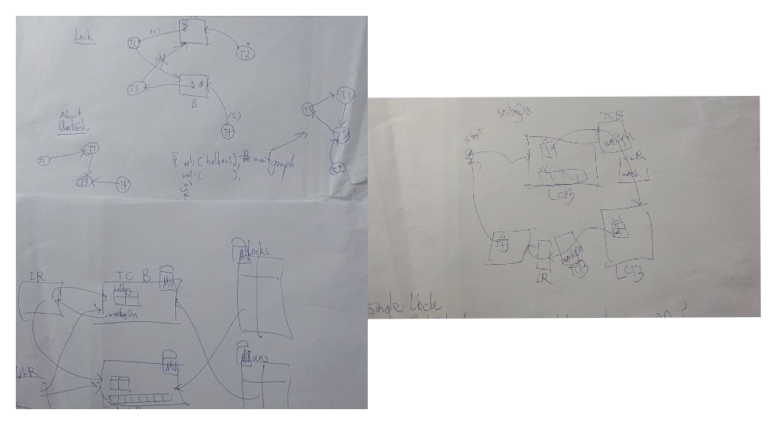

# Transactions & Concurrency Control

## Lab details

See [../GoDB-lab-s26/lab3.md](../GoDB-lab-s26/lab3.md)

## Test Results

* Lock Manager: https://drive.google.com/file/d/1cH0q4HMUfFC6WiDaFmmEtJhCHVUZXdQN/view


## Related Source Code

https://github.com/timyiu478/mit-database-systems/pull/3/changes

## Design Choices

### Lock Manager



The Lock Manager utilizes a Concurrent Hash Map (Lock Registry) to manage Lock Control Blocks (LCBs) for every unique resource (Table or Tuple).

When a transaction requests a lock:

* Immediate Grant: The lock is granted if the requested mode is compatible with current holders and the waiter queue is empty.
* Blocking (FIFO Fairness): If there is a conflict or if other transactions are already waiting, the request is appended to the end of a FIFO Waiter Queue. The transaction then blocks on its own dedicated notification channel.
* Strict Fairness: By enforcing a FIFO queue, we prevent livelock/starvation, ensuring that newer, high-privilege requests (like an X lock) cannot perpetually jump ahead of older pending requests.

Upgrade requests (e.g., S -> X) are handled within the same FIFO framework. To distinguish an upgrade from a new request, the manager checks the Holders map of the LCB. If the requester is already a holder, the request is treated as an upgrade. Crucially, a transaction may exist as both a Holder (of its current mode) and a Waiter (for its target mode) simultaneously.

Upon Unlock(), the manager performs a Cascading Grant Sweep. It iterates through the waiter queue, transitioning compatible transactions to "Holder" status and waking them via their channels. This process continues until the manager encounters a waiter whose requested mode is incompatible with the current set of holders.

Rather than using prevention (like Wait-Die), this system employs a Dynamic Deadlock Detection strategy to allow for maximum concurrency.

* Wait-For Graph (WFG): Instead of rebuilding the graph from scratch, Lock() and Unlock() perform **incremental updates** to a persistent WFG.
* Dependency Mapping: The graph tracks both Waiter-to-Holder dependencies and **Waiter-to-Waiter dependencies** (where a later waiter is blocked by the FIFO requirement of an earlier, incompatible waiter).

* Detection Trigger:
    * Standard: A background detector runs with a 200µs delay after a state change.
    * High Contention: If the system detects >1,000 waiters, the detector triggers immediately to clear bottlenecks.
    * Resolution: A **singleton** Deadlock Resolver performs a DFS (Depth-First Search) to identify cycles. To minimize the cost of **rolled-back** work, the **youngest** transaction (highest TID) in the cycle is selected as the victim and aborted.



Key Assumptions and Guardrails

* Sequential Execution: The design assumes each transaction is strictly sequential; a transaction blocked on a Lock() call will not attempt further lock or unlock operations until granted or aborted.
* Atomic State Transitions: All modifications to LCBs and the WFG are protected by fine-grained synchronization to prevent race conditions between concurrent requests and the singleton deadlock resolver.

## Implementation Challenges

### Lock Manager

* Synchronisation between unlocking and deadlock detection
    * How to avoid self-deadlock
    * Deadlock avoidance between unlocking and deadlock detection
    * How to deal with or prevent "Double Abort" (Two different lock requests (say, Tid A and Tid B) both trigger deadlockDetect. Both calls to findCycle identify the same cycle and pick the same victim (e.g., Tid 36))
    * Permanent deadlock cycle vs temporary waiting
* Hierarchical locking's lock/unlock pipeline
    * Need to differentiate between Explicit Locks (user-requested) and Implicit/Intent Locks (system-generated to support the hierarchy)
    * Need to differentiate between lock upgrades and new lock requests
    * Atomic table-tuple acquisition (if lock manager requires to lock table level tag implicitly)
* Be fair to transactions waiting
    * wait queue will add at least one more dependency between transactions

## Mistakes I made

### Lock Manager

#### 1. Incorrect Wake-up Logic (The "Single Waiter" Problem)

For ensuring waiter fairness, the lock manager will store the lock request into the waiters queue and handle them in FIFO manner. The lock requestor will wait for its own request to be processed on the `waitCh` channel when its lock request is not compatible with the existing holder(s) of the target lock object or the waiters queue is not empty.

My initial implementation only signaled the first transaction in the FIFO waiters queue upon a lock release.

This caused waiter starvation and reduced throughput. For example, if multiple transactions were waiting for Shared (S) locks, only the one at the head of the queue would wake up, while others remained asleep—even though the resource was now compatible with all of them.

Thus, when a lock is released, the Lock Manager should iterate through the waiters queue and wake up a contiguous prefix of compatible requests. The process should only stop when it encounters a request that is incompatible with the currently held modes (e.g., an Exclusive (X) lock request).

#### 2. Misunderstanding Deadlock Error Responsibility

I initially assumed the Lock Manager should automatically release all locks held by a transaction if it encountered a DeadlockError.

However, actually a DeadlockError is a notification to the caller, not an internal command for the Lock Manager to purge the transaction's history.

The responsibility for cleanup lies with the Transaction Manager.

#### 3. Overlapping States: Being a "Waiter" and "Holder" Simultaneously

From the logs, I found cases where a transaction was "granted" a lock it was already trying to release, or was perceived as waiting for a lock it already held.

```
2026/05/09 13:56:18 Tid 2 is trying to unlock tag Table(1)
2026/05/09 13:56:18 Granted tag Table(1) to waiter 2 with mode LockModeX
```

This happened because I failed to remove a granted transaction from the lcb.waiters queue atomically and immediately upon granting the lock.

#### 4. A "needle in a haystack" deadlock

My deadlock detection was too localized. I only initiated a DFS (Depth First Search) starting from the head of a specific resource’s waiters queue.

I missed cycles that did not involve the "head" waiter. As shown in my "Step 5" example, a cycle can form between $T_1$ and $T_2$ on Table B, even if $T_3$ is the one at the front of the queue for Table A. Because the DFS started at $T_3$, it never "saw" the $T_1 \to T_2 \to T_1$ loop.



#### 5. Incorrect coverage

In my initial implementation, I treated lock hierarchy as a linear scale where Shared (S) was assigned a higher privilege than Intention-Exclusive (IX). This led isLockModeCovered to incorrectly return true when a transaction holding an S lock requested an IX lock.

```go
lm.coverage = map[DBLockMode]int{
    LockModeX: 0,
    LockModeSIX: 1,
    LockModeS: 2,
    LockModeIX: 3,
    LockModeIS: 4,
}
func (lm *LockManager) isLockModeCovered(mode1 DBLockMode, mode2 DBLockMode) bool {
	return lm.coverage[mode1] <= lm.coverage[mode2]
}
```

I updated the logic to recognize that the privilege of modes follows a partial order rather than a linear one. I assigned S and IX the same numerical rank but added an explicit check to prevent them from covering one another.

```go
lm.coverage = map[DBLockMode]int{
    LockModeX: 0,
    LockModeSIX: 1,
    LockModeS: 2,
    LockModeIX: 2,
    LockModeIS: 3,
}
func (lm *LockManager) isLockModeCovered(mode1 DBLockMode, mode2 DBLockMode) bool {
	if mode1 == LockModeS && mode2 == LockModeIX || mode2 == LockModeS && mode1 == LockModeIX {
		return false
	}
	return lm.coverage[mode1] <= lm.coverage[mode2]
}
```

#### 6. The Deadlock Resolution Wake-up Bug

Lets consider this scenario:

```
Table A:
* Holders: {T1: S}
* Waiters: [T2(X), T3(S), T4(S)]

Table B:
* Holders: {T2: S}
* Waiters: [T1(X)]

T2 is blocked by T1.
T3 and T4 are compatible with T1, but are blocked by T2 because of your FIFO requirement in lock().
Deadlock: Suppose T1 requests a lock that creates a cycle with T2.
```

In my initial implementation, the deadlock detector correctly identifies the cycle and elects T2 as the victim. T2 is aborted and its request is scrubbed from the Table A waiters queue.

```
Table A:
* Holders: {T1: S}
* Waiters: [T3(S), T4(S)]
```

Although T3 and T4 are now compatible with the current holder (T1), they remain asleep. In the original logic, the "Wake-up" signal is only triggered by an explicit Unlock() call. Since the victim (T2) was removed by the deadlock resolver rather than a standard unlock, and the remaining holder (T1) is still blocked elsewhere, no signal is ever sent. T3 and T4 become "Orphaned Waiters," blocked indefinitely.

## Key Takeaways


## Sketches

I have included several of my preliminary sketches to provide insight into my process for mapping out designs and resolving bugs. Please keep in mind that these represent **early-stage** thinking; as such, they may contain **inaccuracies** and may not fully align with the final implementation.

### Lock Manager


