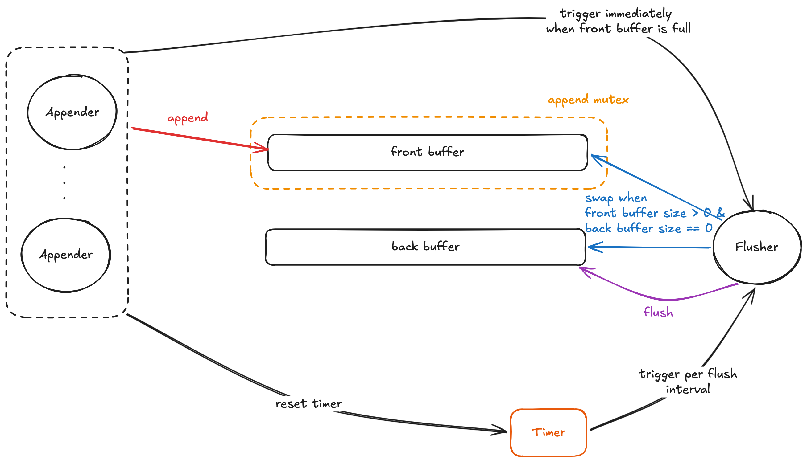
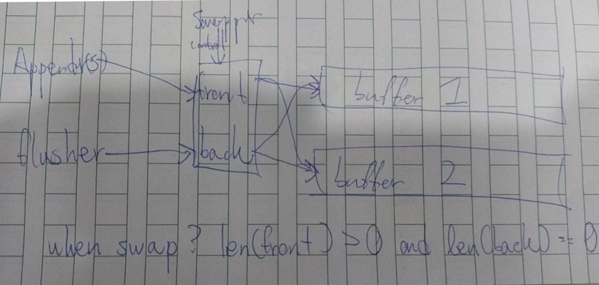

# Logging and Recovery

## Lab details

See [../GoDB-lab-s26/lab4.md](../GoDB-lab-s26/lab4.md)

## Test Results

* Log Record Checksum: https://drive.google.com/file/d/1NFXn2AqLRECRvQ5tYxpld1UBGA4JtLwO/view
* Double Buffer Log Manager: https://drive.google.com/file/d/12wnd9qeP2EG3E5sdR9x6fRfZESg8ZZ8V/view
* Background Dirty Page Flusher: https://drive.google.com/file/d/1GsXG9RFeXBc97igQxQywtFnU8qrvcqLk/view
* Checkpoint Manager: https://drive.google.com/file/d/19w5I-v4jdDb2903qgd4EhO4AVqVrIiIN/view
* Recovery E2E: https://drive.google.com/file/d/1QLO1Rs9jRsu0nlOWpCgJtx0lyflZRKmt/view

## Related Source Code

https://github.com/timyiu478/mit-database-systems/pull/4/changes

## Design Choices

### Double Buffer Log Manager

#### Buffer Swaps



To ensure log data is written sequentially, the system employs **exactly one** dedicated flusher. The flusher is exclusively responsible for writing the contents of the back buffer to the log file on disk and invoking fsync.

The flusher is activated by two distinct mechanisms to balance latency and throughput:

* Ticker (Time-Based): A timer generates a flush signal at a regular interval. Every successful append() operation resets this timer. This optimization allows the system to aggregate more data into the buffer during bursts of activity, minimizing the overall number of expensive disk writes (fsync).
* Front Buffer Full (Size-Based): When the front buffer reaches capacity, the appender that encounters the full buffer immediately sends a signal to the flusher channel. This allows the flusher to swap and drain the buffers instantly without waiting for the timer interval to expire.

Before writing to disk, the flusher must swap the positions of the front and back buffers (if the front buffer has the log record(s)):

* Mutual Exclusion: The swap operation is strictly protected by an append mutex. This lock ensures that the flusher is the **sole actor** interacting with the front buffer during the pointer swap, blocking any concurrent appenders.
* Thread Safety: Because **the back buffer is exclusively managed by the flusher**, and the front buffer is protected by the mutex, the swap operation is entirely thread-safe.
* Appender Unblocking: Immediately after the swap is complete and the empty buffer becomes the new front buffer, the flusher releases the lock and signals/wakes up any appender threads that were blocked waiting for space.


#### Close under load

Objective and Challenge:

When the Close() function is called, there may still be **blocked appender** threads waiting for space to become available in the front buffer. To prevent data loss, the system must ensure that:

* All pending log records from these blocked appenders are successfully flushed to disk before Close() returns.
* Any new incoming Append() calls are immediately rejected after shutdown is initiated.

To achieve this gracefully without race conditions, the system utilizes two atomic variables (closed and waiters) alongside a coordination primitive (a WaitGroup or semaphore).

Synchronization Mechanisms:

* closed (Atomic Boolean): Acts as a shutdown flag. Once set to true, it instantly blocks any new Append() requests from entering the pipeline and signals to the flusher thread that it should terminate once all remaining workloads are cleared.
* waiters (Atomic Integer): Tracks the exact number of appender threads currently blocked and waiting for the front buffer to clear due to an out-of-space condition.
* waitGroup / Semaphore: Coordinates the lifecycle of the flusher thread, ensuring the caller blocks on Close() until the flusher has completely finished its final cycles.

The Append Lifecycle:

1. Upon entry, Append() atomically checks the closed flag. If it is true, the call is immediately rejected.
2. The appender atomically increments waiters
2. If the front buffer is full, the appender blocks.
3. Once unblocked by a buffer swap, it writes its logs and decrements waiters.

The Close Lifecycle:

1. Initiate Shutdown: Close() atomically sets closed to true. This creates an immediate barrier, ensuring the waiters count cannot increase any further.
2. Await Thread Termination: It then blocks on the waitGroup (or semaphore). Because the flusher increments this primitive by 1 on startup, Close() will safely wait until the flusher decrements it to 0 upon exit.

The Flusher Termination Criteria:

* The closed flag is true.
* The waiters count is 0 (meaning all blocked appenders have been woken up and have written their data).
* Both the front and back buffers are completely drained and empty.

#### Log Sequence Number

The system maps each log record's Log Sequence Number (LSN) directly to its physical byte offset within the log file. This design choice offers two distinct advantages:

* Zero Storage Overhead: Because the LSN is inherently derived from the file position, there is no need to expend disk or memory space to explicitly store an LSN metadata field within the record itself.
* $O(1)$ Direct Seek Time: Log iterators can skip right to a target startLSN using a single, constant-time file seek operation, completely eliminating the need to parse or index the log sequentially to find a starting point.

## Mistakes I made

### Log File Iterator

In the initial implementation, I used `bufio.Reader.Read()` to read record data.

```
data := make([]byte, size)
_, err = iter.reader.Read(data)
```

However, `Read()` does not guarantee that the entire requested slice will be filled in a single call, which could lead to incomplete record reads.

I replaced this with `io.ReadFull(reader, data)` to ensure the full record is read before attempting to deserialize it.


## Sketches

I have included several of my preliminary sketches to provide insight into my process for mapping out designs and resolving bugs. Please keep in mind that these represent **early-stage** thinking; as such, they may contain **inaccuracies** and may **not fully align** with the final implementation.

### Double Buffer Log Manager


