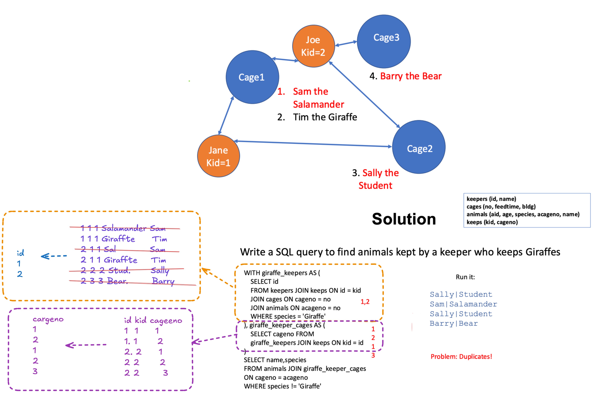

Q. Why does this SQL query will return the results with duplicates?

Because keeper_cages contains the same cageno more than once.
Cage 1 and Cage 2 each appear twice because two different giraffe-keeping keepers keep them.

Q. What problems does schema normalization solve? Do you believe that these are important problems?

Q. What is the distinction between BCNF and 3NF? Is there a reason to prefer one over the other?

Q. Think about a data set you have worked with recently, and try to derive a set of functional dependencies that correspond to it. What assumptions did you have to make in modeling your data in this way?

Q. How is it that ER modeling generally leads to BCNF/3NF schemas?

Takeaways:

* SQL query can be very complex e.g. recusive query, combination of joins and recurive queryies
