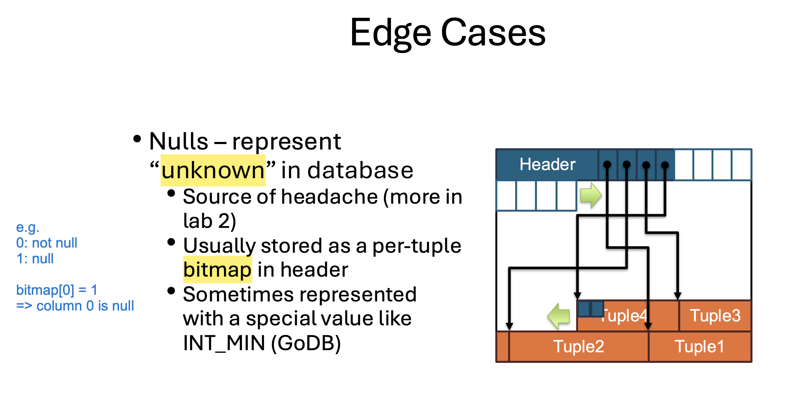

DB Design Challenges:

* Optimize/Minimise disk access
    * manage database that exceed the available amount of memory is needed
    * memory speed: 100ns vs SSD speed: 160,000ns

Page Storage Architecture:  PageID corresponds to physical location on file

* File is OS abstraction
* Why cannot "delete" a physical page?
    * It will the Calculation of pageID to file offset
    * A page only can be unallocated/claimed/freed

Page Design: continuous storage - metadata + bucket of tuples

* Problems
    * deletion overhead: either leaves a hole or shift subsequent tuples forward to fill the gap 
    * update overhead: how to deal with the size change of a tuple? shift other tuples?
    * how to find the tuple if record id does not correspond to physical location of the page?

How to represent null:

Lock vs Latch:

* Lock: protect database content (row, table) from concurrent transactions; held by users
* Latch: protect DB internal data structure (e.g. page table); held by threads

Q. Hardware (e.g. SSDs) and OS (e.g. VM) also use pages. Why do we introduce yet another paging mechanism?

The DBMS needs a logical unit of storage that matches hardware blocks but also supports record management, indexing, concurrency, and recovery.
