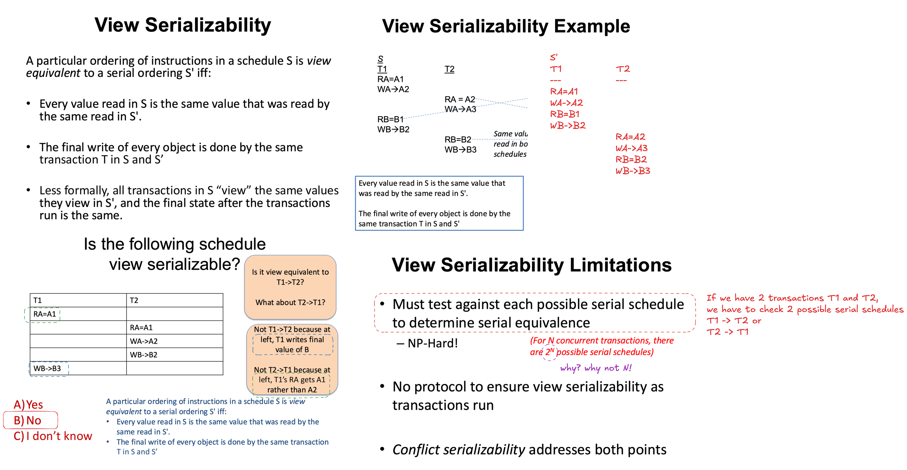
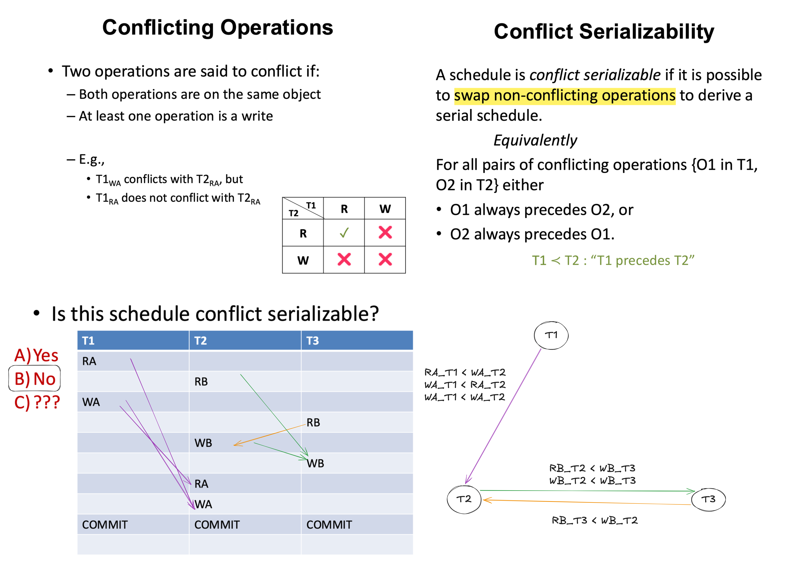
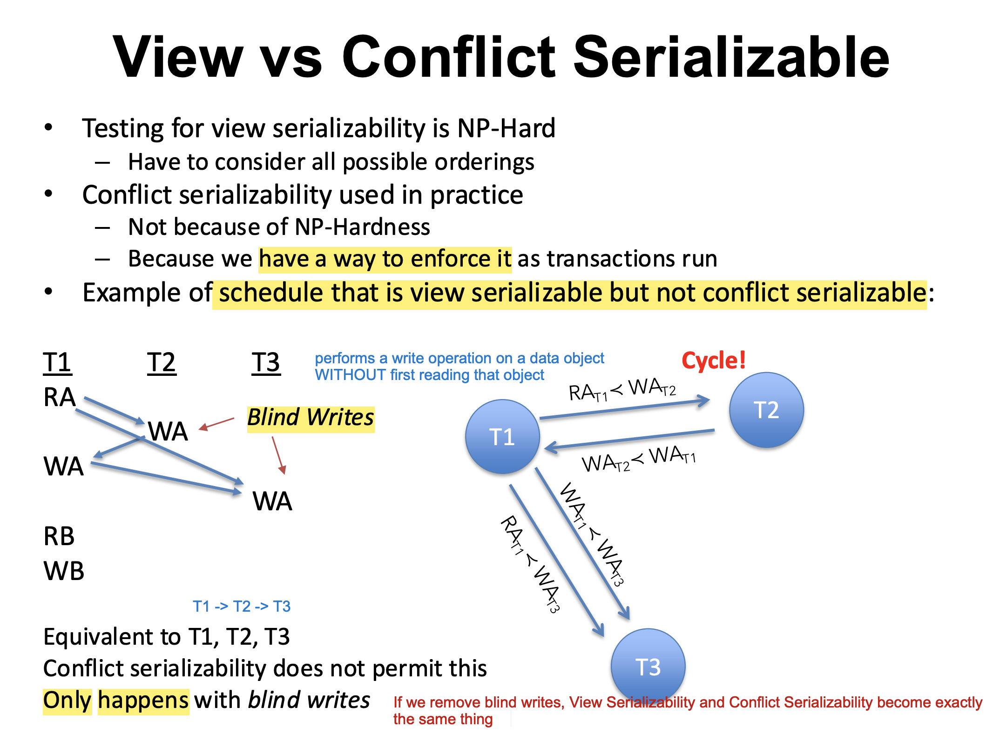
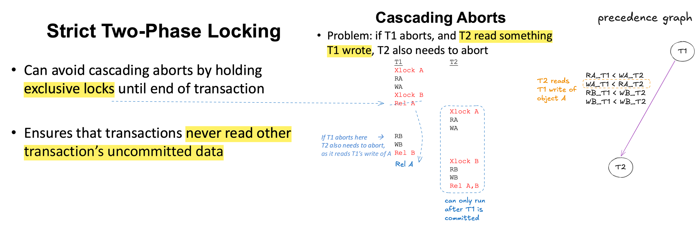

Goal of concurrency control: allow concurrent execution while preserving serial equivalence

In serial schedule T1 -> T2, T2 can see T1's writes.

View Serialisability:

Conflict Serializability:

View vs Conflict Serialisability:

2PL Cascading Abort & Strict 2PL:

Noted that Strict 2PL does not prevent deadlock.

Key takeaways:

* 2PL correctness intuition
* How does strict 2PL prevent cascading abort
