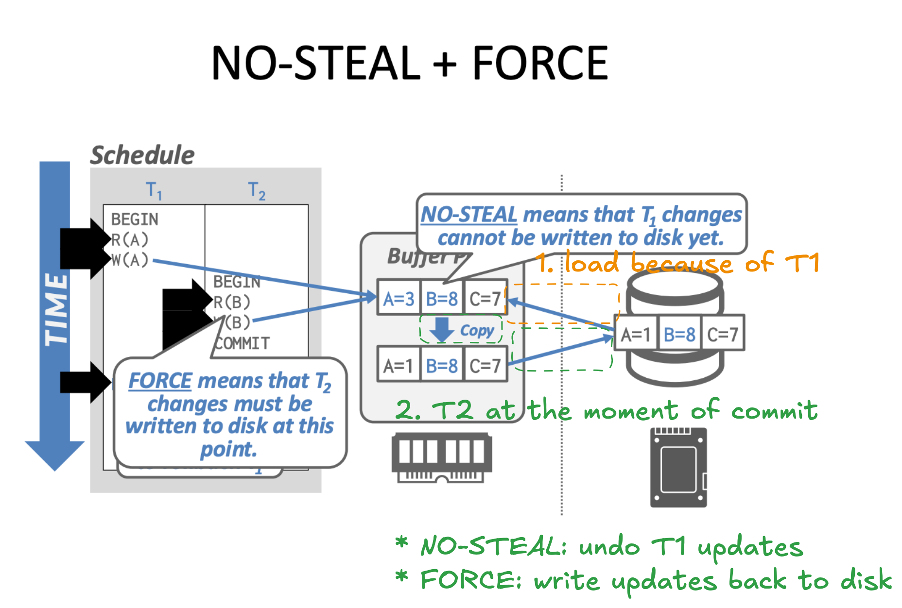

The FORCE policy in database recovery refers specifically to **the moment of commit**, **NOT during** the transaction itself.
The STEAL policy is about what can happen during a transaction lifetime, not just at commit.

NO STEAL + FORCE:

* overhead of copying
* write amplification: a commit transaction updated 1 row needs to write back a page to disk

Q. Why can group commit amortize the overhead?

It group a set of small and expensive "sync" calls (the CPU spends most of its time WAITING for the "I'm done" signal from the hardware) into single one.

