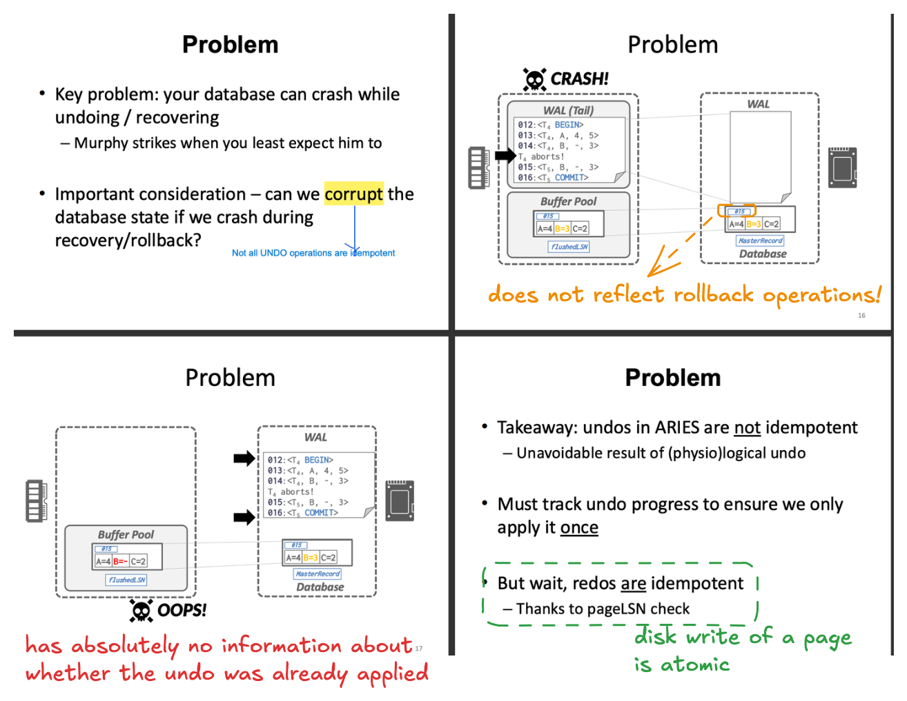

Q. why three phases?

Q. Why redo uncommitted transactions?

Q. Why are CLRs necessary?

Q. To allow logical undo, we must recover the system to the state before it failed?

UNDO problem: has no enough information to handle undo after the system crashes

