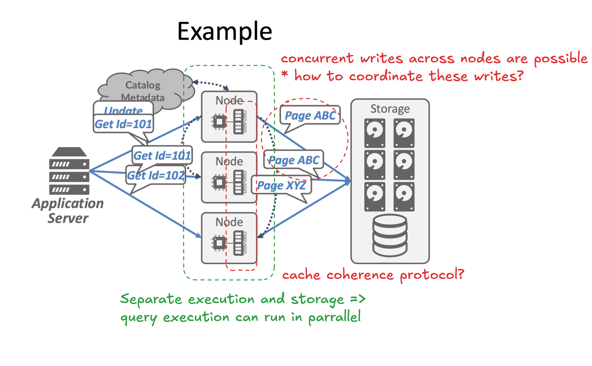
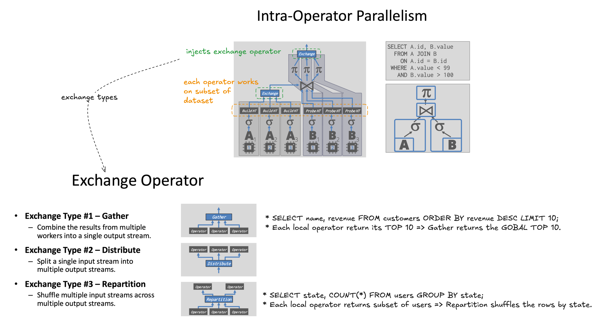
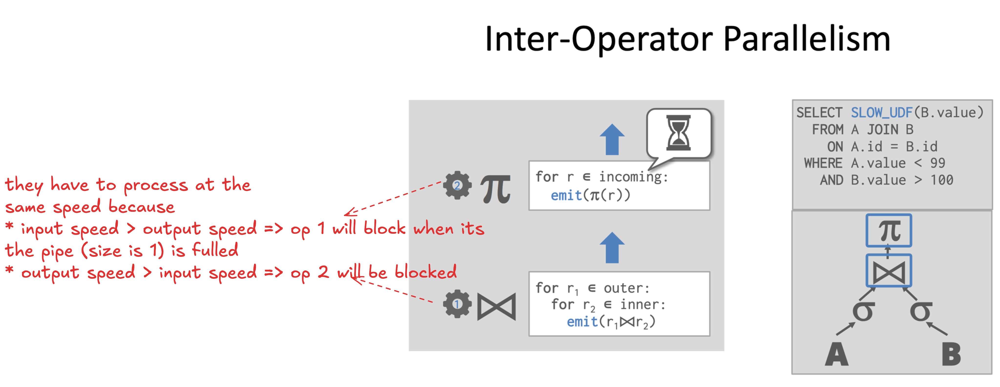

Shared Disk approach:

* Challenges:
    * concurrency control across nodes
        * distributed lock manager may needed
    * cache Coherency complexities across network
    * make performance worse when the storage/disk is the botteneck

Barries to linear scaling:

* startup time of processors
    * processors are not always stand-by for saving energy/money
* Interference: the penalty we pay when we try to parallelize work that relies on shared resources
    * the "traffic jam" limit
    * e.g. shared network, shared disk
* Amdahl’s Law
    * the "waiting line limit"
    * some portions of the system are not parallelize/strictly serializable
        * e.g. Write ahead log, global timestamp in OCC

Intra-Operator Parallelism:

Inter-Operator Parallelism/Pipelined Parallelism:

Q. Why not partititon db by table per node?

* In reality, access patterns are not uniform (some tables are more popular than others) => load unbalance in some nodes
* Tables join are often.

Replication Design Choices:

* Replication Configuration: Primary-Backup, Multi-Master
* Propagation scheme: synchronous, asychronous
* Propagation timing: continuous, on commit
* Update Method: Active-Active, Active-Passive
    * Active-Active: each replica executes the transaction independently
    * Active-Passive: each txn executes at a single location andpropagates the changes to the replica
