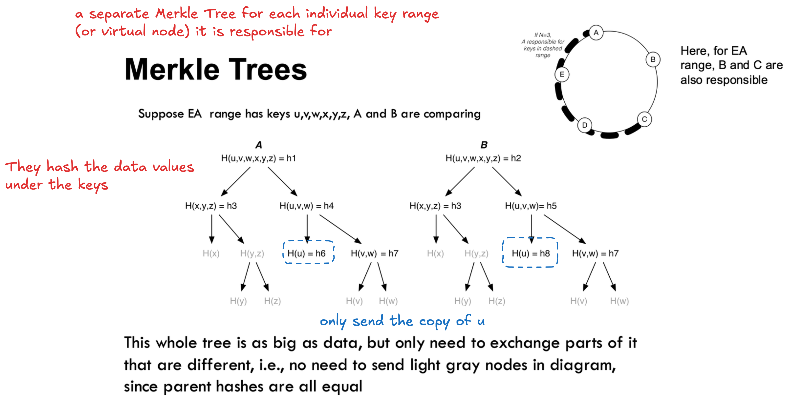

Hinted Handoff:

* the node know it is not the primary owner based on **its membership list**
* In network partition case, the node can think it is the primary owner so it wont perform hinted handoff.

Vector Clock:

* allow to identity concurrent updates/conflicts
* if a system uses vector clocks to detect conflicts and then resolves those conflicts using LWW, it absolutely still causes **silent data loss**.

Q. Suppose there are three replicas, R1, R2, and R3. Three writes are performed to key K, resulting in three version clocks. Which of the following are true statements?

V3 is true. Three writes are performed to key K => sum of vector clock should equal to 3.

```
V1 =<R1:0,R2:3,R3:2>
V2 =<R1:1,R2:3,R3:2>
V3 =<R1:0,R2:0,R3:3>
```

Anti-Entropy for data sync:


