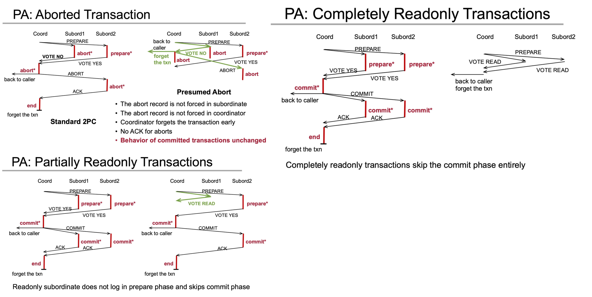
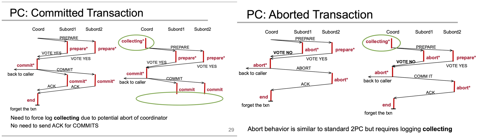
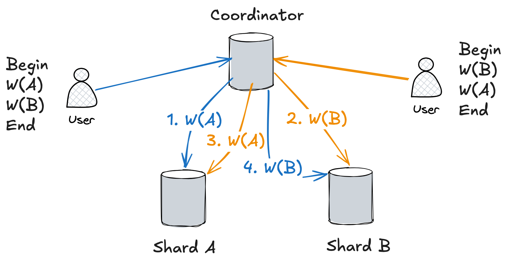
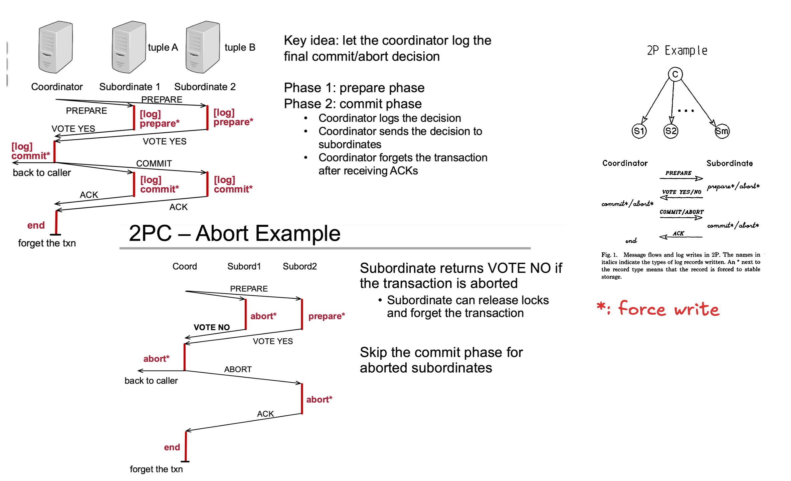

# Oneline Summary

This paper explains the standard two-phase commit protocol and proposes two optimized variants—Presumed Abort and Presumed Commit — to reduce logging and message overhead.

---

# Key Ideas

* 2PC: let the coordinator make the final decision
* Presumed Abort: if the coordinator has no information and subordinate ask about the final decision, then answer abort
* Presumed Commit: if the coordinator has no information and subordinate ask about the final decision, then answer commit

---

# 2PC Variants

* Number of network messages
    * e.g. ACK vs no ACK
* Number of log records
* Number of force-write log records 
* Take advantage of (partial) read-only transaction

---

# Details

## Standard 2PC

* Why does coordinator require ACK from subordinate? It needs to know that no subordinate will ever ask about that transaction again and it knows it is safe to write an end record and safely "forget" the transaction. 

## Presumed Abort

* Why does the abort record is not forced in prepared subordinate? Because the subordinate can ask about the correct final decision (abort) even if coordinator "forget" about the transaction/decision.
* Coordinator does not know the distributed transaction is partial/fully read-only transaction upfront. It requires info (VOTE-READ) from subordinates to know it.

## Presumed Commit

* The `collecting*` record:
    * Purpose: distinguish two cases
        * (1) Coordinator fails before making a final decision
        * (2) Coordinator safely forgot about the transaction
    * How:
        * Record the name of transaction and the subordinates in this transaction
        * (1): find subordinate txn inquery in `collecting*`
        * (2): finds absolutely no active record or log of it anywhere
* Coordinator fails before force writing final-decision on stable storage: abort transaction
* When can coordinator safely "forget" this transaction for commit case? After it records "commit" in the log with force-write.

---

# Questions

## Q. When can a distributed deadlock happen?

## Q. In the “R*” paper, how does the two phase commit (2PC) protocol work? What problem does it solve? What are the costs of using it?

* What problem does it solve? It solves the problem of allowing user run distributed transaction transparently and atomically despite network or process failure can happen.
* Assumptions: 
    * global unique transaction number is required
    * Each site applied logging, concurrency control, and recovery protocols
* Force-Write: the participant or coordinator cannot send the next network message until the log record is safely flushed to non-volatile storage (disk/SSD)
* Dealing with Network/Process Failures:
    * Prepare Phase:
        * Coordinator "dies" before subordinate moved to prepared state: subordinate self-abort
        * Subordinate "dies" after coordinator sending PREPARE message: coordinator self-abort (enter Abort Phase)
        * "dies": no response after timeout, tcp connection dis-connected
    * Commit/Abort Phase:
        * prepared: subordinate periodically ask the coordinator for the final results.
        * see committing/aborting record: Coordinator sends final decision after recovery.
* Costs:
    * Number of Logs: 2 record for each subordinate(both force-write), 2 record for coordinator (1 is force-write)
    * Network Messages: 2 meesages for each subordinates, 2 message for coordinator

## Q. Why does the correct response to an inquery in NO INFORMATION case is an abort? What is the meaning of NO INFORMATION?

"No Information" means that when a coordinator’s recovery process receives a query from a subordinate about a specific transaction, it finds no record or trace of that transaction in its active memory or its disk logs.

This state occurs because the coordinator crashed before the commit point (before force-writing a COMMIT record to its log), which can happen at two stages:

* Before sending PREPARE: The transaction was mid-flight and never even started the commit protocol.
* After sending PREPARE but before deciding: The coordinator was actively collecting votes but crashed before it could make a global decision. Because it hasn't written a COMMIT record, it has completely lost the context of the votes.

In the Two-Phase Commit protocol, no node can commit unless all nodes are voted "YES" and the coordinator officially writes a COMMIT record. Since the coordinator has "No Information" (meaning no COMMIT log record exists on its disk), we can deduce two absolute facts:

The coordinator never reached a global decision to commit. Therefore, it is impossible for any other subordinate in the cluster to have received a COMMIT command or to have committed locally. Because no node has committed, executing a rollback is 100% safe and preserves atomicity.

Committing would be completely unsafe because the coordinator cannot verify if every node was actually ready or voted yes.

Noted that the coordinator cannot re-run the 2PC protocol because the user query is lost on coordinator side.

## Q. What is the significance of the Presumed Abort/Presumed Commit variants of 2PC? How do they reduce the overhead of 2PC? When should you choose one over the other?

The Presumed Abort/Presumed Commit improve the performace of 2PC by reducing the number of force-write log records, number of network messages. Because in 2PC protocol, the disk write and network communication costs are often the performace bottleneck. The core idea of these variants is make preassumption of what happens to a transaction when no information about it is found in the log.

When to use Presumed Abort?

* Transaction failure rate is not negligible

When to use Presumed Commit?

* Transaction failure rate is negligible
* Network latency is the primary bottleneck

---

# Other Learning Materials

* https://pages.cs.wisc.edu/~yxy/cs764-f25/slides/L22.pdf
