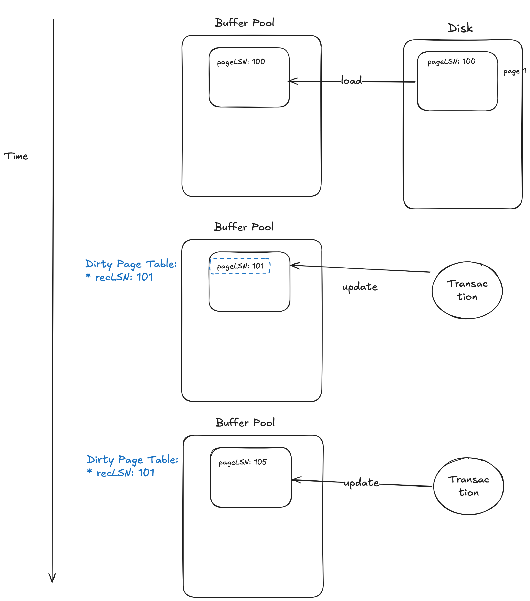

# Takeaways


---

# Details

---

# Questions

Q. pageLSN vs recLSN

recLSN: oldest update to page x since it was last flushed
pageLSN: latest update to page x



Q. Why do we store the LSN of the `<CHECKPOINT-BEGIN>` record in the MasterRecord instead of the `<CHECKPOINT-END>` record?

* The `<CHECKPOINT-END>` record only cover the state that before the `<CHECKPOINT-BEGIN>` record.
    * The `<CHECKPOINT-BEGIN>` record itself contains no data about the database state.
* If recovery started scanning forward from the `<CHECKPOINT-END>` record, the changes between the `<CHECKPOINT-BEGIN>` record and the `<CHECKPOINT-END>` record will be missed.

```
LOG: ... [UPDATE] -> [<CHECKPOINT-BEGIN>] -> [UPDATE] -> [UPDATE] -> [<CHECKPOINT-END> (with ATT+DPT)] ...
```


