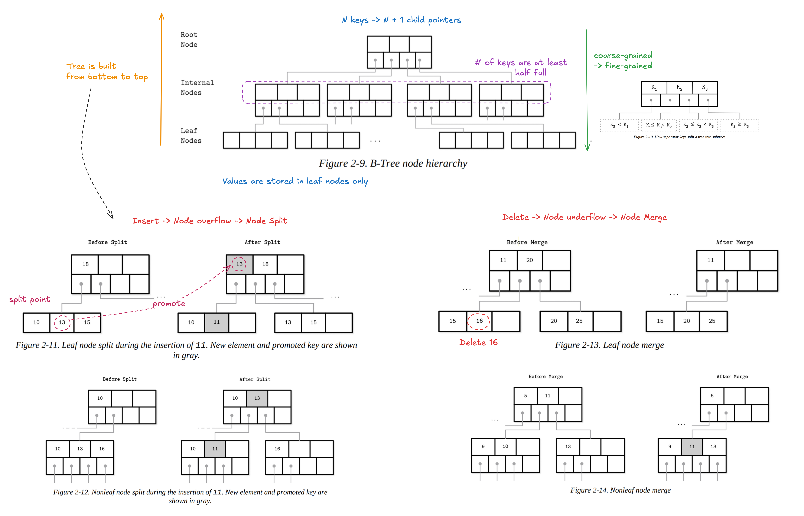

# Problems of Ondisk Binary Tree

* Low fanout
    * => High Tree height - O(log_2_n) to search the leaf element => O(log_2_n) of disk I/O
    * => A few skewed insertions/deletion (e.g., sorted data) can make one branch much deeper than the other => rotate the pointers for tree rebalancing frequently (ensure the height difference between subtrees are at most 1)
* Locality: no guarantee that a newly created child node is written on disk close to its parent => random access on spinning disk is slow

# On-Disk Data Structure

* Favour sequential access over random access
* Favour few disk access
* Aware the limitation of the smallest disk operation unit is block (512 bytes - 4KB)

# B-Tree

# Questions

Q. What is the purpose of the neighbor pointers in a B+Tree? When are they useful?

The neighbor pointers in a B+Tree link leaf nodes together to form a singly or doubly linked list.

They are useful in deletion operation when the target node is underflow. They provide immediate access to siblings for borrowing or merging.

They are also useful in range query. After finding the starting key via the tree height, the system can iterate horizontally through the leaves without needing to backtrack to parent nodes.
