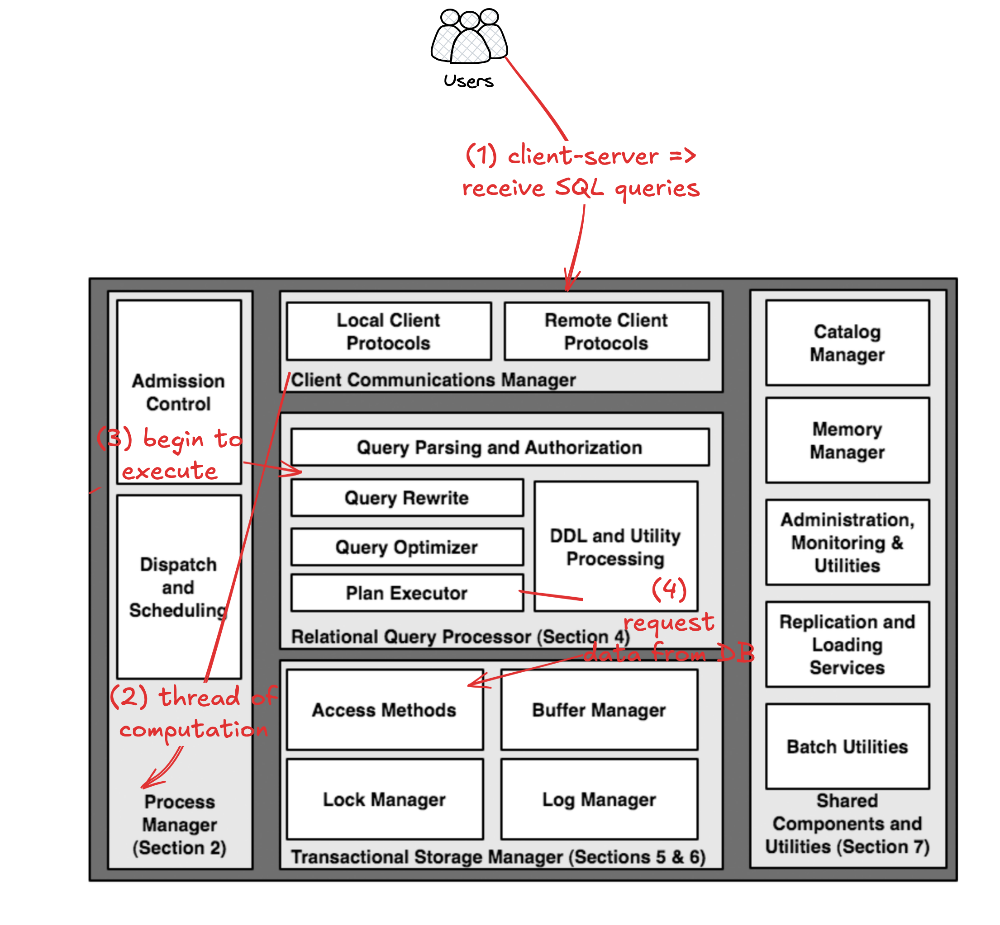
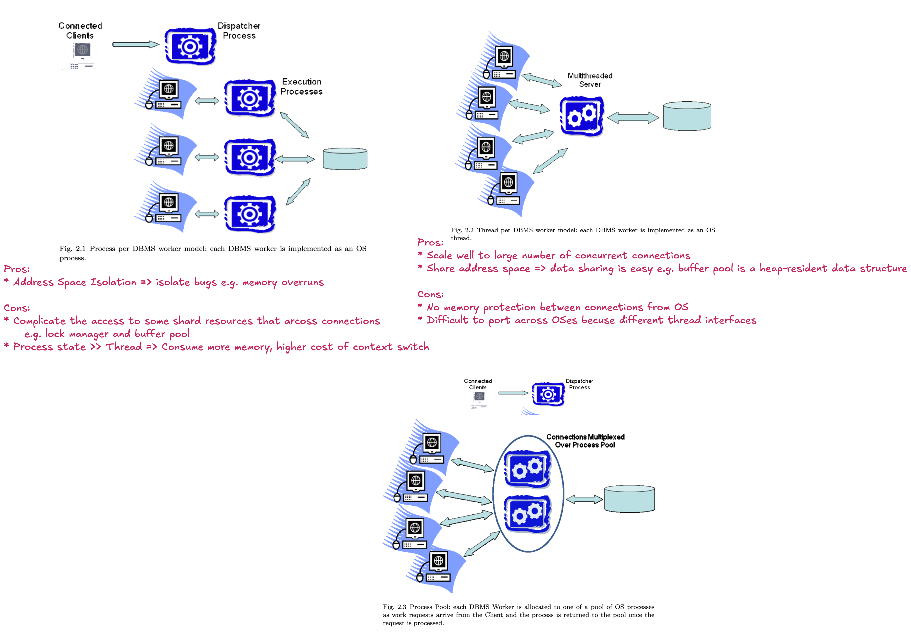
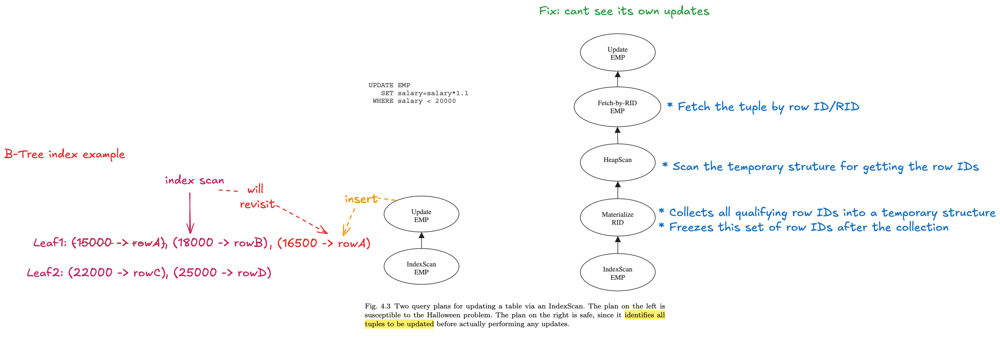

# Goal of this paper

Presents the architecture disscusion of DBMS design principles including
process models, parrallel architecture, storage system design, transaction
system implementation, query processor and optimator architecture, and typical
shared components and utilies.

---

# Section 1: Introduction

High-level view of the life of the query:



---

# Section 2: Process Models

Key decision that the multi-user system needs to make: How the exeuction of the concurrent user requests ared mapped to the operating system processes or threads?

1:1 mapping exits between DBMS worker and DBMS client.

Assumptions:

* OS kernel thread memory overhead is small and context switch is inexpensive
* Uniprocessor hardware

Process Models: Process per DBMS worker, Thread per DBMS worker, and Process pool.



Postgres uses process models: https://www.interdb.jp/pg/pgsql02/01.html

Client communication buffers: SQL is typically used in a **pull model**: clients consume result tuples from a query cursor by repeatedly issuing the SQL FETCH request.

Admission Control Policy: does not accept rew work until DBMS has enough resource to process it.

* Tier 1: keep # of client connections under a threshold
* Tier 2: query optimizer estimates the workload of the query and decide whether postpone the exeuction of the query

---

# Section 3: Parallel Architecture: Processes and Memory Coordination


---

# Section 4: Relational Query Processor

Query Rewrite:

* View expansion
* Constant arithmetic evaluation: e.g. R.x < 10+2+R.y => R.x < 12+R.y
* Logical rewrite of predicates: 
    * e.g. salary < 100 and salary > 200 => false => can return empty result without accessing database
    * e.g. R.x < 10 and R.x = S.y => R.x < 10 and R.x = S.y and S.y < 10 => increase the ability of query optimizer choose plans that can filiter data in early execution.
* ~ preprocessing in Postgres: https://www.interdb.jp/pg/pgsql03/03.html#331-preprocessing

Query Optimizer:

* Job: transform internal query representation into an efficient query plan for executing the query.


Query Executor:

* Approach 1: Query optimizer compiles data flow graph into low level opcodes. Query Exeuctor is a interrupter of those opcodes.
* Approach 2: Query executor receives data flow graph. It recursively invokes procedures for the operators based on the graph layout.
* Iterator Model
    * Operator is the subclass of iterator class
    * Pull-based execution: every operator only produces output when its parent asks for it.
    * Couple data flow with control flow: a tuple is returned to the paraent in the graph when the control is returned.
    * e.g. A Join operator calls next() on its child operators (say, two table scans). Each child operator produces tuples one at a time. The Join combines them and returns the result tuple upward.
    * When the parent operator (say, a Project or Aggregate) calls Join.next(), the join operator produce one tuple of its output.
    * Where is the data?
        * (1) BP-tuple: tuples resides in pages in the buffer pool
        * (2) M-tuple: iterator allocate heap space to store tuples and copy-out tuples from buffer pool
            * pros: avoid bugs related buffer pool e.g. hold a page for a long time because of long period of execution
            * cons: memory copy can be a performance bottleneck
        

```c
class iterator{
    iterator &inputs[];
    void init();
    tuple get_next();
    void close();
}
```

Halloween Problem:




---

# Questions

Q. OS threads vs Lightweight thread package

OS threads are scheduled by kernel scheduler.
Lightweight threads are scheduled by application level thread scheudler.
Lightweight threads in kernel POV is a single thread of execution.

* pros: no mode switch for scheduling
* cons: no I/O concurrency in synchronous I/O

Q. What are the advantages of defering security check in query plan execution time?

Q. Query Rewrite vs Query Optimizer

Q. In the end of section 4.4.1, the author said "In an iterator model, since one of the iterators is always active, resource utilization is maximized". What does this mean?

Q. How does iterator model support parrallel query execution?


