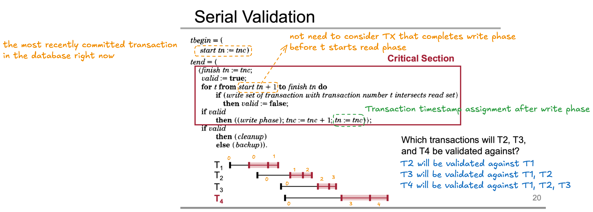

# Summary

* This paper presents a optimistic concurrency control method for the systems that the transaction conflicts are unlikely occur.
* The goal of this method is elimating pessimistic locking.
* It splits the transaction into three phrase: Read, Validation, and Write.
* The purpose of validation is determining whether the transactions respect the serialization of transactions by their assigned timestamps.
* A serial validation puts timestamp assignment, validation phase, and write phase in to the a critical section.


# Key Takeaways

* The considerations about assigning transaction timestamp

---

# Details

## Inherent disadvantages of locking approach

1. Lock maintenance overhead: deadlock detection
2. Need to wait the locked congestion node (lock can only be released after commit/abort to avoid dirty read and cascading abort) for memory access

## Transaction Phases (RVW)

1. Read(or Modify): writes are stored in local buffer
2. Validation: determine the transaction will not cause the a loss of integrity
3. Write: the writes in local buffer are made global


* The validation phase begins when user sends `tend` call to commit the transaction
* Writes become visible by updating the **pointers/object descriptors** => fast
* Easy for recovery: NO UNDO
    * crash during read phase: do nothing because 0 global data was touched
    * crash during validation phase: just REDO because the entire write set already in WAL
* Validation fails => restart transaction

## Serial Equivalence

For each transaction Tj with transaction number t(j), and for all Ti with t(i) < t(j); one of the following three conditions must hold:

1. Ti completes before Tj: Ti completes its write phase before Tj starts its read phase
2. Ti write set is disjoint with Tj read set: Ti completes its write phase before Tj starts its write phase
3. Ti write set is disjoint with Tj read and write sets: Ti completes its read phase before Tj completes its read phase

so that executing the concurrent system yields the exact same final database state:

DB final state = T_n(T_(n-1)(T_(n-2)(...T_1(DB initial state))))

## Assigning Timestamp

* Why assign transaction timestamp at the beginning of the read phase is a bad idea?
    * Read section 3.2
* Assigning timestamp at the end of the read phase:
    * Pro: conditional 3 of validating serial equivalence is auto satisfied
    * Challenge: the **write sets** of all transactions that completed their read phase before T but had not yet completed their write phase at the start of T must be examined.
        * avoid read stale data and write-write conflict

```
Tj:                              |--- R -----|--- V -----|----- W ------|
Ti:  |--- R-------|--- V-----|---- W ----|

// we cant immeidately forget the write set of Ti after Ti completes the write phase
// because we needs it when Tj enters the validation phase
```

## Serial Validation

* critical section: timestamp assignment, validation phase, and write phase
* write is serialized => no write-write conflict
* only need to ensure overlapping transactions do not write anything that the transaction read 
* For read-only transaction, its validation can be done without critical section and it has no timestamp



## Parallel Validation

* transaction begin is same as serial validation

TODO

---

# Questions

## Q. When would you expect that optimistic concurrency control would outperform locking-based concurrency control?

* Conflicts between the transactions are rarely occur.
* When conflicts are rarely occur?
    * # of nodes in DB >> # of nodes in running transactions
    * probability of modifying congestion node is small
    * most transactions are read-only

## Q. Can optimistic concurrency control result in deadlock?

No. It does NOT use lock at read phase. So it is deadlock-free.

## Q. When can a system forget the read set of a transaction?

* When the transaction enters write phase
* No read->read conflict: Read operations are inherently side-effect free
* No write->read conflict (from future transactions): A transaction never reads unvalidated writes from other transactions during its Read Phase


## Q. When can a system forget the write set of a transaction?

In theory, we can discard $WS(T_i)$ when every active transaction in the system started its Read Phase AFTER $T_i$ finished its Write Phase.

But the timestamp assignment is happen in the end of read phase. So the system has no global timestamp for the active transactions that are in read phase. It makes the system hard to answer "what are the active transaction's read phases are overlapped with $T_i$'s write phase".

To solve this problem, we can assign a start txn timestamp (not real transaction number) at the very beginning of the read phase to know when can safely forget a Write Set. If $T_{active}$ records a start tn of 5, it means $T_{active}$ is reading a database state that includes all writes up to transaction 5. The system knows $T_{active}$ will only ever need to validate against transactions 6 and higher.Therefore, once every currently active transaction in the system has a start tn $\ge$ 5, the system can safely delete the Write Sets for transactions upto 5.

Note that a slow or abandoned transaction (a "zombie") that never finishes its Read Phase can completely block garbage collection in a system using start tn tracking.

To avoid a slow transaction blocks the garbage collection:

* the system can maintains a large enough of most recent write sets.
    * If $T_{slow}$ takes so long that the number of new committed transactions exceeds $K$, its start tn falls outside the history window.
    * When $T_{slow}$ finally tries to validate, the engine sees that $WS(\text{start tn} + 1)$ has already been purged.
    * Result: $T_{slow}$ fails validation immediately and is forced to abort.
* transaction timeout => abort

## Q. When OCC use serial validation, Why for read-only transaction, its validation can be done without critical section?

* No write phrase because it does not modify any global state
* No timestamp assignment because it will not overlapping with future transactions
* It reads from commited transactions only and it validates purely against immutable history (newly committed transaction can't change it).
